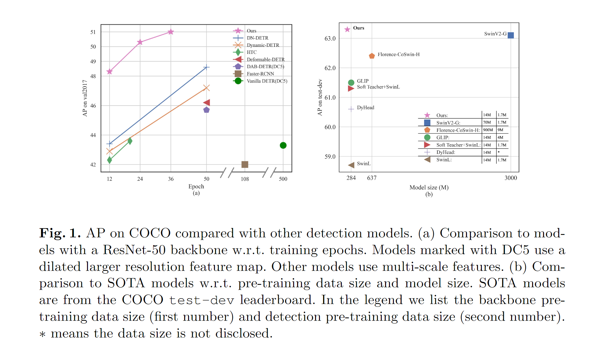
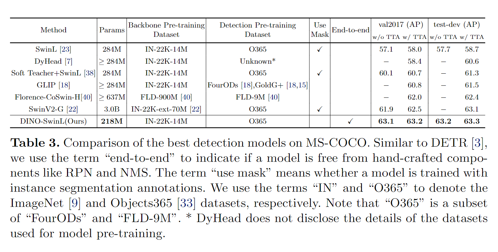
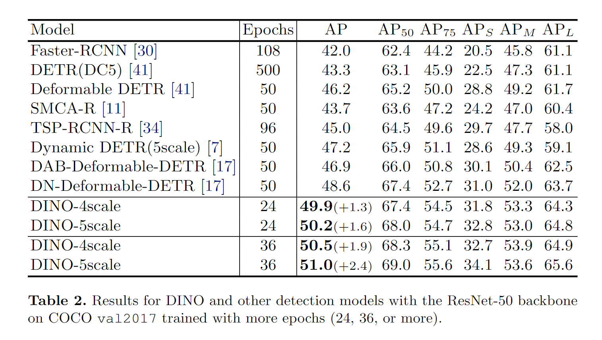
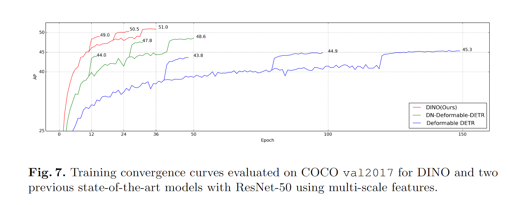
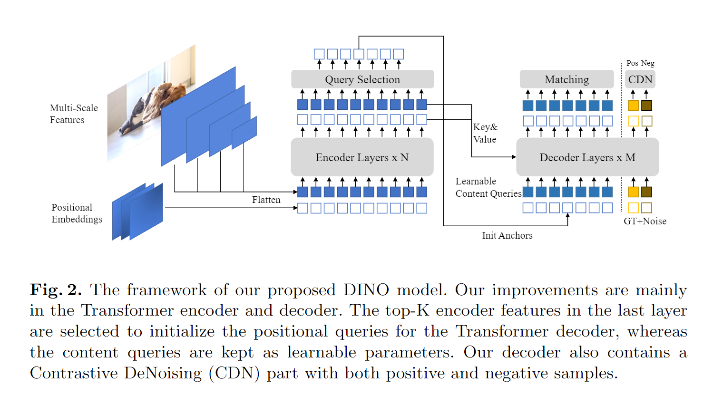

[](https://paperswithcode.com/sota/object-detection-on-coco-minival?p=dino-detr-with-improved-denoising-anchor)
[](https://paperswithcode.com/sota/object-detection-on-coco?p=dino-detr-with-improved-denoising-anchor)

This is the official implementation of the paper "[DINO: DETR with Improved DeNoising Anchor Boxes for End-to-End Object Detection](https://arxiv.org/abs/2203.03605)".

Authors: Hao Zhang\*, [Feng Li](https://scholar.google.com/citations?hl=zh-CN&user=ybRe9GcAAAAJ)\*, [Shilong Liu](https://www.lsl.zone/)\*, [Lei Zhang](https://www.leizhang.org/), [Hang Su](https://www.suhangss.me/), [Jun Zhu](https://ml.cs.tsinghua.edu.cn/~jun/index.shtml), [Lionel M. Ni](https://www.cse.ust.hk/~ni/), [Heung-Yeung Shum](https://scholar.google.com.hk/citations?user=9akH-n8AAAAJ&hl=en)

Code is under preparation, please be patient.

# News
[2022/3/8]: We reach the SOTA on [MS-COCO leader board](https://paperswithcode.com/sota/object-detection-on-coco) with **63.3AP**!

# Abstract
We present DINO (\textbf{D}ETR with \textbf{I}mproved de\textbf{N}oising anch\textbf{O}r boxes), a state-of-the-art end-to-end object detector. % in this paper. DINO improves over previous DETR-like models in performance and efficiency by using a contrastive way for denoising training, a mixed query selection method for anchor initialization, and a look forward twice scheme for box prediction. DINO achieves 48.3AP in 12 epochs and 51.0AP in 36 epochs on COCO with a ResNet-50 backbone and multi-scale features, yielding a significant improvement of +4.9\textbf{AP} and +2.4\textbf{AP}, respectively, compared to DN-DETR, the previous best DETR-like model. DINO scales well in both model size and data size. Without bells and whistles, after pre-training on the Objects365 dataset with a SwinL backbone, DINO obtains the best results on both COCO \texttt{val2017} (63.2\textbf{AP}) and \texttt{test-dev} (\textbf{63.3AP}). Compared to other models on the leaderboard, DINO significantly reduces its model size and pre-training data size while achieving better results.

# Results






# Methods



# bibtex
```
@misc{zhang2022dino,
      title={DINO: DETR with Improved DeNoising Anchor Boxes for End-to-End Object Detection}, 
      author={Hao Zhang and Feng Li and Shilong Liu and Lei Zhang and Hang Su and Jun Zhu and Lionel M. Ni and Heung-Yeung Shum},
      year={2022},
      eprint={2203.03605},
      archivePrefix={arXiv},
      primaryClass={cs.CV}
}
```